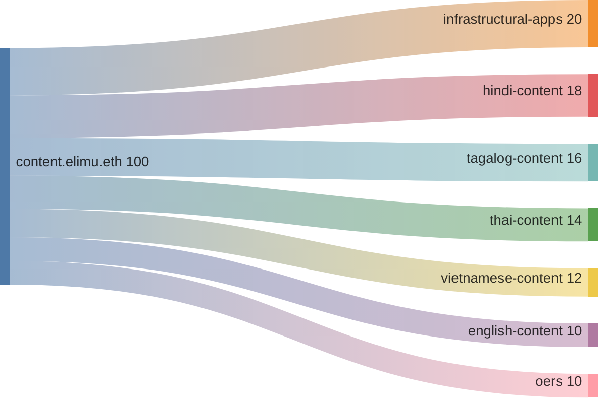
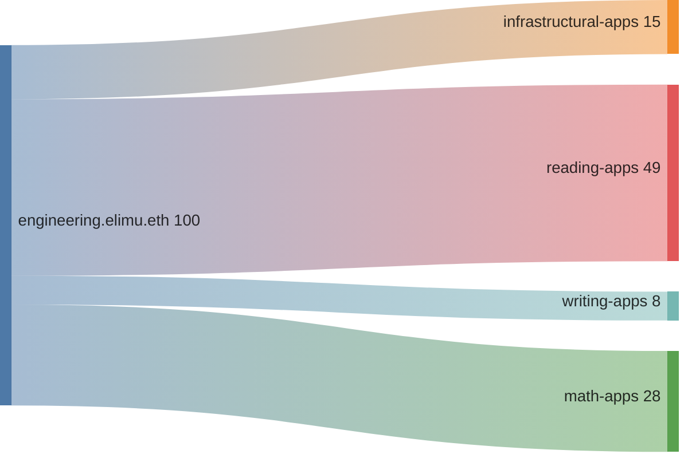
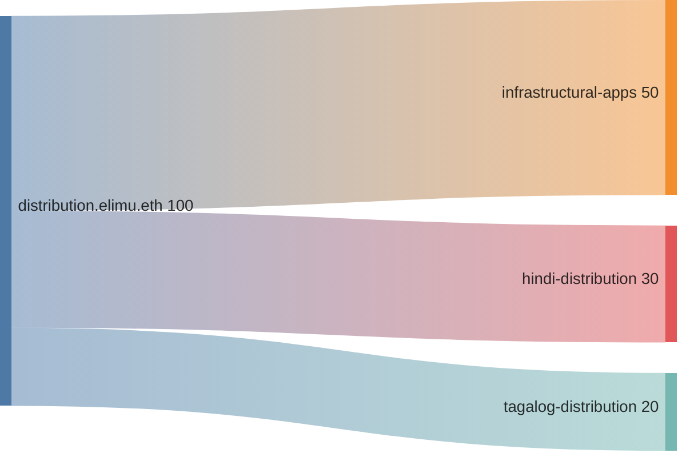

# Drip List Funding Splits 💦

> An overview of projects included in the elimu.ai [Drip List 💧](https://www.drips.network/app/drip-lists/41305178594442616889778610143373288091511468151140966646158126636698)

> [!NOTE]
> The Drip List is used both for external fundraising and for our internal [monthly token allocation](https://github.com/elimu-ai/web3-wiki/blob/main/TOKENOMICS.md#monthly-token-allocation).

The top-level Drip List is owned by the [Ξlimu DAO](https://github.com/elimu-ai/web3-wiki/blob/main/README.md#dao)'s ENS name, while each sub-list (and its projects) is managed by an ENS subname:
```
elimu.dao.eth
├─── content.elimu.eth
├─── engineering.elimu.eth
└─── distribution.elimu.eth
```

<a name="content"></a>

## 1. Content Creation 🎶🎙️

[Drip list💧](https://www.drips.network/app/drip-lists/44233954899343831995062217275215737681377860849646413826815741964161)



| Project | Manager | Funding Split CSV | Drips URL |
| --- | --- | --- | --- |
| [webapp](https://github.com/elimu-ai/webapp) https://github.com/elimu-ai/web3-wiki/labels/infrastructural%F0%9F%8F%97%EF%B8%8F | `content.elimu.eth` | [`FUNDING_SPLITS.csv`](./funding-splits-content/github_webapp/FUNDING_SPLITS.csv) | [Project](https://www.drips.network/app/projects/github/elimu-ai/webapp) |
| [webapp-lfs](https://github.com/elimu-ai/webapp-lfs) https://github.com/elimu-ai/web3-wiki/labels/infrastructural%F0%9F%8F%97%EF%B8%8F | `content.elimu.eth` | [`FUNDING_SPLITS.csv`](./funding-splits-content/github_webapp-lfs/FUNDING_SPLITS.csv) | [Project](https://www.drips.network/app/projects/github/elimu-ai/webapp-lfs) |
| Hindi Language 🏏🐯 | `content.elimu.eth` | [`FUNDING_SPLITS.csv`](./funding-splits-content/lang-HIN/FUNDING_SPLITS.csv) | [Drip List](https://www.drips.network/app/drip-lists/44233954899343831995062217275215737681377860849646413826815741964160) |
| Tagalog Language 🏝️🦎 | `content.elimu.eth` | [`FUNDING_SPLITS.csv`](./funding-splits-content/lang-TGL/FUNDING_SPLITS.csv) | [Drip List](https://www.drips.network/app/drip-lists/44233954899343831995062217275215737681377860849646413826815741964163) |
| Thai Language 🥭🐘 | `content.elimu.eth` | [`FUNDING_SPLITS.csv`](./funding-splits-content/lang-THA/FUNDING_SPLITS.csv) | [Drip List](https://www.drips.network/app/drip-lists/44233954899343831995062217275215737681377860849641030872883728374792) |
| Vietnamese Language 🥖🏮 | `content.elimu.eth` | [`FUNDING_SPLITS.csv`](./funding-splits-content/lang-VIE/FUNDING_SPLITS.csv) | [Drip List](https://www.drips.network/app/drip-lists/44233954899343831995062217275215737681377860849657661057867624699363) |
| English Language 🍔🏈 | `content.elimu.eth` | [`FUNDING_SPLITS.csv`](./funding-splits-content/lang-ENG/FUNDING_SPLITS.csv) | [Drip List](https://www.drips.network/app/drip-lists/44233954899343831995062217275215737681377860849646413826815741964162) |
| OERs 📚🎬 | `content.elimu.eth` |  | [Drip List](https://www.drips.network/app/drip-lists/44233954899343831995062217275215737681377860849646413826815741964165) |

<a name="engineering"></a>

## 2. Engineering & AI/ML 👩🏽‍💻📱

[Drip list💧](https://www.drips.network/app/drip-lists/41305178594442616889778610143373288091511468151140966646158126636699)



| Project | Manager | Funding Split CSV | Drips URL |
| --- | --- | --- | --- |
| [common-utils](https://github.com/elimu-ai/common-utils) https://github.com/elimu-ai/web3-wiki/labels/infrastructural%F0%9F%8F%97%EF%B8%8F | `engineering.elimu.eth` | [`FUNDING_SPLITS.csv`](./funding-splits-engineering/github_common-utils/FUNDING_SPLITS.csv) | [Project](https://www.drips.network/app/projects/github/elimu-ai/common-utils) |
| [content-provider](https://github.com/elimu-ai/content-provider) https://github.com/elimu-ai/web3-wiki/labels/infrastructural%F0%9F%8F%97%EF%B8%8F | `engineering.elimu.eth` | [`FUNDING_SPLITS.csv`](./funding-splits-engineering/github_content-provider/FUNDING_SPLITS.csv) | [Project](https://www.drips.network/app/projects/github/elimu-ai/content-provider) |
| [kukariri](https://github.com/elimu-ai/kukariri) https://github.com/elimu-ai/web3-wiki/labels/infrastructural%F0%9F%8F%97%EF%B8%8F | `engineering.elimu.eth` | [`FUNDING_SPLITS.csv`](./funding-splits-engineering/github_kukariri/FUNDING_SPLITS.csv) | [Project](https://www.drips.network/app/projects/github/elimu-ai/kukariri) |
| [ml-storybook-reading-level](https://github.com/elimu-ai/ml-storybook-reading-level) https://github.com/elimu-ai/web3-wiki/labels/infrastructural%F0%9F%8F%97%EF%B8%8F | `engineering.elimu.eth` | [`FUNDING_SPLITS.csv`](./funding-splits-engineering/github_ml-storybook-reading-level/FUNDING_SPLITS.csv) | [Project](https://www.drips.network/app/projects/github/elimu-ai/ml-storybook-reading-level) |
| [ml-storybook-recommender](https://github.com/elimu-ai/ml-storybook-recommender) https://github.com/elimu-ai/web3-wiki/labels/infrastructural%F0%9F%8F%97%EF%B8%8F | `engineering.elimu.eth` | [`FUNDING_SPLITS.csv`](./funding-splits-engineering/github_ml-storybook-recommender/FUNDING_SPLITS.csv) | [Project](https://www.drips.network/app/projects/github/elimu-ai/ml-storybook-recommender) |
| [model](https://github.com/elimu-ai/model) https://github.com/elimu-ai/web3-wiki/labels/infrastructural%F0%9F%8F%97%EF%B8%8F | `engineering.elimu.eth` | [`FUNDING_SPLITS.csv`](./funding-splits-engineering/github_model/FUNDING_SPLITS.csv) | [Project](https://www.drips.network/app/projects/github/elimu-ai/model) |
| [VoltAir](https://github.com/elimu-ai/VoltAir) https://github.com/elimu-ai/web3-wiki/labels/reading%F0%9F%93%96 | `engineering.elimu.eth` | [`FUNDING_SPLITS.csv`](./funding-splits-engineering/github_VoltAir/FUNDING_SPLITS.csv) | [Project](https://www.drips.network/app/projects/github/elimu-ai/VoltAir) |
| [filamu](https://github.com/elimu-ai/filamu) https://github.com/elimu-ai/web3-wiki/labels/reading%F0%9F%93%96 | `engineering.elimu.eth` | [`FUNDING_SPLITS.csv`](./funding-splits-engineering/github_filamu/FUNDING_SPLITS.csv) | [Project](https://www.drips.network/app/projects/github/elimu-ai/filamu) |
| [herufi](https://github.com/elimu-ai/herufi) https://github.com/elimu-ai/web3-wiki/labels/reading%F0%9F%93%96 | `engineering.elimu.eth` | [`FUNDING_SPLITS.csv`](./funding-splits-engineering/github_herufi/FUNDING_SPLITS.csv) | [Project](https://www.drips.network/app/projects/github/elimu-ai/herufi) |
| [image-picker](https://github.com/elimu-ai/image-picker) https://github.com/elimu-ai/web3-wiki/labels/reading%F0%9F%93%96 | `engineering.elimu.eth` | [`FUNDING_SPLITS.csv`](./funding-splits-engineering/github_image-picker/FUNDING_SPLITS.csv) | [Project](https://www.drips.network/app/projects/github/elimu-ai/image-picker) |
| [maneno](https://github.com/elimu-ai/maneno) https://github.com/elimu-ai/web3-wiki/labels/reading%F0%9F%93%96 | `engineering.elimu.eth` | [`FUNDING_SPLITS.csv`](./funding-splits-engineering/github_maneno/FUNDING_SPLITS.csv) | [Project](https://www.drips.network/app/projects/github/elimu-ai/maneno) |
| [silabi](https://github.com/elimu-ai/silabi) https://github.com/elimu-ai/web3-wiki/labels/reading%F0%9F%93%96 | `engineering.elimu.eth` |  | [Project](https://www.drips.network/app/projects/github/elimu-ai/silabi) |
| [sound-cards](https://github.com/elimu-ai/sound-cards) https://github.com/elimu-ai/web3-wiki/labels/reading%F0%9F%93%96 | `engineering.elimu.eth` | [`FUNDING_SPLITS.csv`](./funding-splits-engineering/github_sound-cards/FUNDING_SPLITS.csv) | [Project](https://www.drips.network/app/projects/github/elimu-ai/sound-cards) |
| [storybooks](https://github.com/elimu-ai/storybooks) https://github.com/elimu-ai/web3-wiki/labels/reading%F0%9F%93%96 | `engineering.elimu.eth` |  | [Project](https://www.drips.network/app/projects/github/elimu-ai/storybooks) |
| [visemes](https://github.com/elimu-ai/visemes) https://github.com/elimu-ai/web3-wiki/labels/reading%F0%9F%93%96 | `engineering.elimu.eth` |  | [Project](https://www.drips.network/app/projects/github/elimu-ai/visemes) |
| [vitabu](https://github.com/elimu-ai/vitabu) https://github.com/elimu-ai/web3-wiki/labels/reading%F0%9F%93%96 | `engineering.elimu.eth` | [`FUNDING_SPLITS.csv`](./funding-splits-engineering/github_vitabu/FUNDING_SPLITS.csv) | [Project](https://www.drips.network/app/projects/github/elimu-ai/vitabu) |
| [walezi-android](https://github.com/elimu-ai/walezi-android) https://github.com/elimu-ai/web3-wiki/labels/reading%F0%9F%93%96 | `engineering.elimu.eth` |  | [Project](https://www.drips.network/app/projects/github/elimu-ai/walezi-android) |
| [chat](https://github.com/elimu-ai/chat) https://github.com/elimu-ai/web3-wiki/labels/writing%E2%9C%8D%F0%9F%8F%BD | `engineering.elimu.eth` | [`FUNDING_SPLITS.csv`](./funding-splits-engineering/github_chat/FUNDING_SPLITS.csv) | [Project](https://www.drips.network/app/projects/github/elimu-ai/chat) |
| [handwriting-letters](https://github.com/elimu-ai/handwriting-letters) https://github.com/elimu-ai/web3-wiki/labels/writing%E2%9C%8D%F0%9F%8F%BD | `engineering.elimu.eth` |  | [Project](https://www.drips.network/app/projects/github/elimu-ai/handwriting-letters) |
| [handwriting-numbers](https://github.com/elimu-ai/handwriting-numbers) https://github.com/elimu-ai/web3-wiki/labels/writing%E2%9C%8D%F0%9F%8F%BD | `engineering.elimu.eth` |  | [Project](https://www.drips.network/app/projects/github/elimu-ai/handwriting-numbers) |
| [keyboard](https://github.com/elimu-ai/keyboard) https://github.com/elimu-ai/web3-wiki/labels/writing%E2%9C%8D%F0%9F%8F%BD | `engineering.elimu.eth` | [`FUNDING_SPLITS.csv`](./funding-splits-engineering/github_keyboard/FUNDING_SPLITS.csv) | [Project](https://www.drips.network/app/projects/github/elimu-ai/keyboard) |
| [CameraColorPicker](https://github.com/elimu-ai/CameraColorPicker) https://github.com/elimu-ai/web3-wiki/labels/math%F0%9F%94%A2 | `engineering.elimu.eth` |  | [Project](https://www.drips.network/app/projects/github/elimu-ai/CameraColorPicker) |
| [calculator](https://github.com/elimu-ai/calculator) https://github.com/elimu-ai/web3-wiki/labels/math%F0%9F%94%A2 | `engineering.elimu.eth` | [`FUNDING_SPLITS.csv`](./funding-splits-engineering/github_calculator/FUNDING_SPLITS.csv) | [Project](https://www.drips.network/app/projects/github/elimu-ai/calculator) |
| [missing-number](https://github.com/elimu-ai/missing-number) https://github.com/elimu-ai/web3-wiki/labels/math%F0%9F%94%A2 | `engineering.elimu.eth` |  | [Project](https://www.drips.network/app/projects/github/elimu-ai/missing-number) |
| [nambari](https://github.com/elimu-ai/nambari) https://github.com/elimu-ai/web3-wiki/labels/math%F0%9F%94%A2 | `engineering.elimu.eth` |  | [Project](https://www.drips.network/app/projects/github/elimu-ai/nambari) |
| [nyas-space-quest](https://github.com/elimu-ai/nyas-space-quest) https://github.com/elimu-ai/web3-wiki/labels/math%F0%9F%94%A2 | `engineering.elimu.eth` | [`FUNDING_SPLITS.csv`](./funding-splits-engineering/github_nyas-space-quest/FUNDING_SPLITS.csv) | [Project](https://www.drips.network/app/projects/github/elimu-ai/nyas-space-quest) |
| [nyas-space-quest-qd](https://github.com/elimu-ai/nyas-space-quest-qd) https://github.com/elimu-ai/web3-wiki/labels/math%F0%9F%94%A2 | `engineering.elimu.eth` | [`FUNDING_SPLITS.csv`](./funding-splits-engineering/github_nyas-space-quest-qd/FUNDING_SPLITS.csv) | [Project](https://www.drips.network/app/projects/github/elimu-ai/nyas-space-quest-qd) |
| [shapi](https://github.com/elimu-ai/shapi) https://github.com/elimu-ai/web3-wiki/labels/math%F0%9F%94%A2 | `engineering.elimu.eth` |  | [Project](https://www.drips.network/app/projects/github/elimu-ai/shapi) |
| [soga](https://github.com/elimu-ai/soga) https://github.com/elimu-ai/web3-wiki/labels/math%F0%9F%94%A2 | `engineering.elimu.eth` | [`FUNDING_SPLITS.csv`](./funding-splits-engineering/github_soga/FUNDING_SPLITS.csv) | [Project](https://www.drips.network/app/projects/github/elimu-ai/soga) |
| [tilt-game](https://github.com/elimu-ai/tilt-game) https://github.com/elimu-ai/web3-wiki/labels/math%F0%9F%94%A2 | `engineering.elimu.eth` |  | [Project](https://www.drips.network/app/projects/github/elimu-ai/tilt-game) |

<a name="distribution"></a>

## 3. Distribution & Data Collection 🛵💨

[Drip list💧](https://www.drips.network/app/drip-lists/31191755684409194768993126690116100972451994534322097113232155071146)



| Project | Manager | Funding Split CSV | Drips URL |
| --- | --- | --- | --- |
| [analytics](https://github.com/elimu-ai/analytics) https://github.com/elimu-ai/web3-wiki/labels/infrastructural%F0%9F%8F%97%EF%B8%8F | `distribution.elimu.eth` | [`FUNDING_SPLITS.csv`](./funding-splits-distribution/github_analytics/FUNDING_SPLITS.csv) | [Project](https://www.drips.network/app/projects/github/elimu-ai/analytics) |
| [appstore](https://github.com/elimu-ai/appstore) https://github.com/elimu-ai/web3-wiki/labels/infrastructural%F0%9F%8F%97%EF%B8%8F | `distribution.elimu.eth` | [`FUNDING_SPLITS.csv`](./funding-splits-distribution/github_appstore/FUNDING_SPLITS.csv) | [Project](https://www.drips.network/app/projects/github/elimu-ai/appstore) |
| [launcher](https://github.com/elimu-ai/launcher) https://github.com/elimu-ai/web3-wiki/labels/infrastructural%F0%9F%8F%97%EF%B8%8F | `distribution.elimu.eth` | [`FUNDING_SPLITS.csv`](./funding-splits-distribution/github_launcher/FUNDING_SPLITS.csv) | [Project](https://www.drips.network/app/projects/github/elimu-ai/launcher) |
| [ml-authentication](https://github.com/elimu-ai/ml-authentication) https://github.com/elimu-ai/web3-wiki/labels/infrastructural%F0%9F%8F%97%EF%B8%8F | `distribution.elimu.eth` | [`FUNDING_SPLITS.csv`](./funding-splits-distribution/github_ml-authentication/FUNDING_SPLITS.csv) | [Project](https://www.drips.network/app/projects/github/elimu-ai/ml-authentication) |
| [ml-datasets](https://github.com/elimu-ai/ml-datasets) https://github.com/elimu-ai/web3-wiki/labels/infrastructural%F0%9F%8F%97%EF%B8%8F | `distribution.elimu.eth` | [`FUNDING_SPLITS.csv`](./funding-splits-distribution/github_ml-datasets/FUNDING_SPLITS.csv) | [Project](https://www.drips.network/app/projects/github/elimu-ai/ml-datasets) |
| [ml-event-simulator](https://github.com/elimu-ai/ml-event-simulator) https://github.com/elimu-ai/web3-wiki/labels/infrastructural%F0%9F%8F%97%EF%B8%8F | `distribution.elimu.eth` | [`FUNDING_SPLITS.csv`](./funding-splits-distribution/github_ml-event-simulator/FUNDING_SPLITS.csv) | [Project](https://www.drips.network/app/projects/github/elimu-ai/ml-event-simulator) |
| [start-guide](https://github.com/elimu-ai/start-guide) https://github.com/elimu-ai/web3-wiki/labels/infrastructural%F0%9F%8F%97%EF%B8%8F | `distribution.elimu.eth` | [`FUNDING_SPLITS.csv`](./funding-splits-distribution/github_start-guide/FUNDING_SPLITS.csv) | [Project](https://www.drips.network/app/projects/github/elimu-ai/start-guide) |
| [web3-sponsors](https://github.com/elimu-ai/web3-sponsors) https://github.com/elimu-ai/web3-wiki/labels/infrastructural%F0%9F%8F%97%EF%B8%8F | `distribution.elimu.eth` | [`FUNDING_SPLITS.csv`](./funding-splits-distribution/github_web3-sponsors/FUNDING_SPLITS.csv) | [Project](https://www.drips.network/app/projects/github/elimu-ai/web3-sponsors) |
| [website](https://github.com/elimu-ai/website) https://github.com/elimu-ai/web3-wiki/labels/infrastructural%F0%9F%8F%97%EF%B8%8F | `distribution.elimu.eth` | [`FUNDING_SPLITS.csv`](./funding-splits-distribution/github_website/FUNDING_SPLITS.csv) | [Project](https://www.drips.network/app/projects/github/elimu-ai/website) |
| Hindi Language 🏏🐯 | `distribution.elimu.eth` | [`FUNDING_SPLITS.csv`](./funding-splits-distribution/lang-HIN/FUNDING_SPLITS.csv) | [Drip List](https://www.drips.network/app/drip-lists/31191755684409194768993126690116100972451994534322097113232155071147) |
| Tagalog Language 🏝️🦎 | `distribution.elimu.eth` | [`FUNDING_SPLITS.csv`](./funding-splits-distribution/lang-TGL/FUNDING_SPLITS.csv) | [Drip List](https://www.drips.network/app/drip-lists/31191755684409194768993126690116100972451994534322097113232155071144) |

---

<p align="center">
  
</p>
<p align="center">
  elimu.ai - Free open-source learning software for out-of-school children 🚀✨
</p>
<p align="center">
  <a href="https://elimu.ai">Website 🌐</a>
  &nbsp;•&nbsp;
  <a href="https://github.com/elimu-ai/wiki#readme">Wiki 📃</a>
  &nbsp;•&nbsp;
  <a href="https://github.com/orgs/elimu-ai/projects?query=is%3Aopen">Projects 👩🏽‍💻</a>
  &nbsp;•&nbsp;
  <a href="https://github.com/elimu-ai/wiki/milestones">Milestones 🎯</a>
  &nbsp;•&nbsp;
  <a href="https://github.com/elimu-ai/wiki#open-source-community">Community 👋🏽</a>
  &nbsp;•&nbsp;
  <a href="https://www.drips.network/app/drip-lists/41305178594442616889778610143373288091511468151140966646158126636698">Support 💜</a>
</p>
