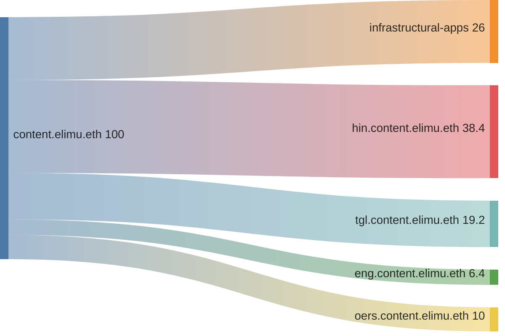
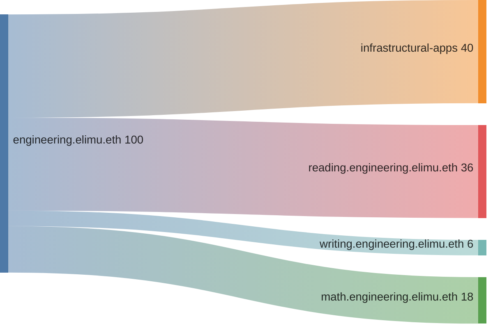
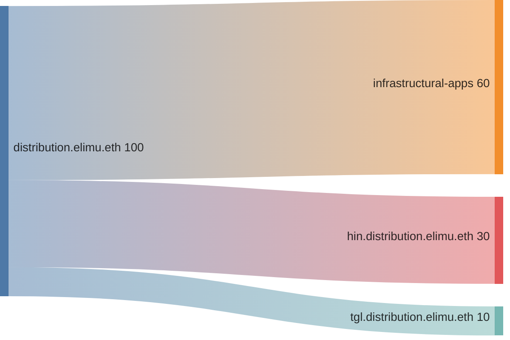

# Drip List Funding Splits 💦

> An overview of projects included in the elimu.ai [Drip List 💧](https://www.drips.network/app/drip-lists/41305178594442616889778610143373288091511468151140966646158126636698)

> [!NOTE]
> The Drip List is used both for external fundraising and for our internal [monthly token allocation](https://github.com/elimu-ai/web3-wiki/blob/main/TOKENOMICS.md#monthly-token-allocation).

The top-level Drip List is owned by the [Ξlimu DAO](https://github.com/elimu-ai/web3-wiki/blob/main/README.md#dao)'s ENS name, while each sub-list (and its projects) is managed by an ENS subname:
```
elimu.dao.eth
├─── content.elimu.eth
│    ├─── hin.content.elimu.eth
│    ├─── tgl.content.elimu.eth
│    ├─── eng.content.elimu.eth
│    └─── oers.content.elimu.eth
├─── engineering.elimu.eth
│    ├─── reading.engineering.elimu.eth
│    ├─── writing.engineering.elimu.eth
│    └─── math.engineering.elimu.eth
└─── distribution.elimu.eth
     ├─── hin.distribution.elimu.eth
     └─── tgl.distribution.elimu.eth
```

<a name="content"></a>

## 1. Content Creation 🎶🎙️

[Drip list💧](https://www.drips.network/app/drip-lists/44233954899343831995062217275215737681377860849646413826815741964161)



| Project | Manager | Funding Split CSV | Drips URL |
| --- | --- | --- | --- |
| [crowdsource](https://github.com/elimu-ai/crowdsource) | `content.elimu.eth` |  | [Project](https://www.drips.network/app/projects/github/elimu-ai/crowdsource) |
| [webapp](https://github.com/elimu-ai/webapp) | `content.elimu.eth` | [`FUNDING_SPLITS.csv`](./funding-splits-content/github_webapp/FUNDING_SPLITS.csv) | [Project](https://www.drips.network/app/projects/github/elimu-ai/webapp) |
| Hindi Language 🏏🐯 | `hin.content.elimu.eth` | [`FUNDING_SPLITS.csv`](./funding-splits-content/lang-HIN/FUNDING_SPLITS.csv) | [Drip List](https://www.drips.network/app/drip-lists/44233954899343831995062217275215737681377860849646413826815741964160) |
| Tagalog Language 🏝️🦎 | `tgl.content.elimu.eth` | [`FUNDING_SPLITS.csv`](./funding-splits-content/lang-TGL/FUNDING_SPLITS.csv) | [Drip List](https://www.drips.network/app/drip-lists/44233954899343831995062217275215737681377860849646413826815741964163) |
| English Language 🍔🏈 | `eng.content.elimu.eth` | [`FUNDING_SPLITS.csv`](./funding-splits-content/lang-ENG/FUNDING_SPLITS.csv) | [Drip List](https://www.drips.network/app/drip-lists/44233954899343831995062217275215737681377860849646413826815741964162) |
| OERs 📚🎬 | `oers.content.elimu.eth` |  | [Drip List](https://www.drips.network/app/drip-lists/44233954899343831995062217275215737681377860849646413826815741964165) |

<a name="engineering"></a>

## 2. Engineering & AI/ML 👩🏽‍💻📱

[Drip list💧](https://www.drips.network/app/drip-lists/41305178594442616889778610143373288091511468151140966646158126636699)



| Project | Manager | Funding Split CSV | Drips URL |
| --- | --- | --- | --- |
| [content-provider](https://github.com/elimu-ai/content-provider) | `engineering.elimu.eth` | [`FUNDING_SPLITS.csv`](https://github.com/elimu-ai/web3-wiki/blob/main/funding-splits-engineering/github_content-provider/FUNDING_SPLITS.csv) | [Project](https://www.drips.network/app/projects/github/elimu-ai/content-provider) |
| [keyboard](https://github.com/elimu-ai/keyboard) | `engineering.elimu.eth` |  | [Project](https://www.drips.network/app/projects/github/elimu-ai/keyboard) |
| [kukariri](https://github.com/elimu-ai/kukariri) | `engineering.elimu.eth` |  | [Project](https://www.drips.network/app/projects/github/elimu-ai/kukariri) |
| [ml-storybook-reading-level](https://github.com/elimu-ai/ml-storybook-reading-level) | `engineering.elimu.eth` | [`FUNDING_SPLITS.csv`](https://github.com/elimu-ai/web3-wiki/blob/main/funding-splits-engineering/github_ml-storybook-reading-level/FUNDING_SPLITS.csv) | [Project](https://www.drips.network/app/projects/github/elimu-ai/ml-storybook-reading-level) |
| [ml-storybook-recommender](https://github.com/elimu-ai/ml-storybook-recommender) | `engineering.elimu.eth` | [`FUNDING_SPLITS.csv`](https://github.com/elimu-ai/web3-wiki/blob/main/funding-splits-engineering/github_ml-storybook-recommender/FUNDING_SPLITS.csv) | [Project](https://www.drips.network/app/projects/github/elimu-ai/ml-storybook-recommender) |
| [model](https://github.com/elimu-ai/model) | `engineering.elimu.eth` | [`FUNDING_SPLITS.csv`](https://github.com/elimu-ai/web3-wiki/blob/main/funding-splits-engineering/github_model/FUNDING_SPLITS.csv) | [Project](https://www.drips.network/app/projects/github/elimu-ai/model) |
| [VoltAir](https://github.com/elimu-ai/VoltAir) | `reading.engineering.elimu.eth` | [`FUNDING_SPLITS.csv`](https://github.com/elimu-ai/web3-wiki/blob/main/funding-splits-engineering/github_VoltAir/FUNDING_SPLITS.csv) | [Project](https://www.drips.network/app/projects/github/elimu-ai/VoltAir) |
| [familiar-word-reading](https://github.com/elimu-ai/familiar-word-reading) | `reading.engineering.elimu.eth` |  | [Project](https://www.drips.network/app/projects/github/elimu-ai/familiar-word-reading) |
| [herufi](https://github.com/elimu-ai/herufi) | `reading.engineering.elimu.eth` |  | [Project](https://www.drips.network/app/projects/github/elimu-ai/herufi) |
| [image-picker](https://github.com/elimu-ai/image-picker) | `reading.engineering.elimu.eth` |  | [Project](https://www.drips.network/app/projects/github/elimu-ai/image-picker) |
| [silabi](https://github.com/elimu-ai/silabi) | `reading.engineering.elimu.eth` |  | [Project](https://www.drips.network/app/projects/github/elimu-ai/silabi) |
| [sound-cards](https://github.com/elimu-ai/sound-cards) | `reading.engineering.elimu.eth` |  | [Project](https://www.drips.network/app/projects/github/elimu-ai/sound-cards) |
| [storybooks](https://github.com/elimu-ai/storybooks) | `reading.engineering.elimu.eth` |  | [Project](https://www.drips.network/app/projects/github/elimu-ai/storybooks) |
| [visemes](https://github.com/elimu-ai/visemes) | `reading.engineering.elimu.eth` |  | [Project](https://www.drips.network/app/projects/github/elimu-ai/visemes) |
| [vitabu](https://github.com/elimu-ai/vitabu) | `reading.engineering.elimu.eth` | [`FUNDING_SPLITS.csv`](https://github.com/elimu-ai/web3-wiki/blob/main/funding-splits-engineering/github_vitabu/FUNDING_SPLITS.csv) | [Project](https://www.drips.network/app/projects/github/elimu-ai/vitabu) |
| [walezi-android](https://github.com/elimu-ai/walezi-android) | `reading.engineering.elimu.eth` |  | [Project](https://www.drips.network/app/projects/github/elimu-ai/walezi-android) |
| [chat](https://github.com/elimu-ai/chat) | `writing.engineering.elimu.eth` |  | [Project](https://www.drips.network/app/projects/github/elimu-ai/chat) |
| [handwriting-letters](https://github.com/elimu-ai/handwriting-letters) | `writing.engineering.elimu.eth` |  | [Project](https://www.drips.network/app/projects/github/elimu-ai/handwriting-letters) |
| [handwriting-numbers](https://github.com/elimu-ai/handwriting-numbers) | `writing.engineering.elimu.eth` |  | [Project](https://www.drips.network/app/projects/github/elimu-ai/handwriting-numbers) |
| [CameraColorPicker](https://github.com/elimu-ai/CameraColorPicker) | `math.engineering.elimu.eth` |  | [Project](https://www.drips.network/app/projects/github/elimu-ai/CameraColorPicker) |
| [android_packages_apps_Calculator](https://github.com/elimu-ai/android_packages_apps_Calculator) | `math.engineering.elimu.eth` |  | [Project](https://www.drips.network/app/projects/github/elimu-ai/android_packages_apps_Calculator) |
| [missing-number](https://github.com/elimu-ai/missing-number) | `math.engineering.elimu.eth` |  | [Project](https://www.drips.network/app/projects/github/elimu-ai/missing-number) |
| [nambari](https://github.com/elimu-ai/nambari) | `math.engineering.elimu.eth` |  | [Project](https://www.drips.network/app/projects/github/elimu-ai/nambari) |
| [nyas-space-quest](https://github.com/elimu-ai/nyas-space-quest) | `math.engineering.elimu.eth` | [`FUNDING_SPLITS.csv`](https://github.com/elimu-ai/web3-wiki/blob/main/funding-splits-engineering/github_nyas-space-quest/FUNDING_SPLITS.csv) | [Project](https://www.drips.network/app/projects/github/elimu-ai/nyas-space-quest) |
| [nyas-space-quest-qd](https://github.com/elimu-ai/nyas-space-quest-qd) | `math.engineering.elimu.eth` | [`FUNDING_SPLITS.csv`](https://github.com/elimu-ai/web3-wiki/blob/main/funding-splits-engineering/github_nyas-space-quest-qd/FUNDING_SPLITS.csv) | [Project](https://www.drips.network/app/projects/github/elimu-ai/nyas-space-quest-qd) |
| [shapi](https://github.com/elimu-ai/shapi) | `math.engineering.elimu.eth` |  | [Project](https://www.drips.network/app/projects/github/elimu-ai/shapi) |
| [soga](https://github.com/elimu-ai/soga) | `math.engineering.elimu.eth` | [`FUNDING_SPLITS.csv`](https://github.com/elimu-ai/web3-wiki/blob/main/funding-splits-engineering/github_soga/FUNDING_SPLITS.csv) | [Project](https://www.drips.network/app/projects/github/elimu-ai/soga) |
| [tilt-game](https://github.com/elimu-ai/tilt-game) | `math.engineering.elimu.eth` |  | [Project](https://www.drips.network/app/projects/github/elimu-ai/tilt-game) |

<a name="distribution"></a>

## 3. Distribution & Data Collection 🛵💨

[Drip list💧](https://www.drips.network/app/drip-lists/31191755684409194768993126690116100972451994534322097113232155071146)



| Project | Manager | Funding Split CSV | Drips URL |
| --- | --- | --- | --- |
| [analytics](https://github.com/elimu-ai/analytics) | `distribution.elimu.eth` | [`FUNDING_SPLITS.csv`](./funding-splits-distribution/github_analytics/FUNDING_SPLITS.csv) | [Project](https://www.drips.network/app/projects/github/elimu-ai/analytics) |
| [appstore](https://github.com/elimu-ai/appstore) | `distribution.elimu.eth` | [`FUNDING_SPLITS.csv`](./funding-splits-distribution/github_appstore/FUNDING_SPLITS.csv) | [Project](https://www.drips.network/app/projects/github/elimu-ai/appstore) |
| [launcher](https://github.com/elimu-ai/launcher) | `distribution.elimu.eth` | [`FUNDING_SPLITS.csv`](./funding-splits-distribution/github_launcher/FUNDING_SPLITS.csv) | [Project](https://www.drips.network/app/projects/github/elimu-ai/launcher) |
| [ml-authentication](https://github.com/elimu-ai/ml-authentication) | `distribution.elimu.eth` | [`FUNDING_SPLITS.csv`](./funding-splits-distribution/github_ml-authentication/FUNDING_SPLITS.csv) | [Project](https://www.drips.network/app/projects/github/elimu-ai/ml-authentication) |
| [ml-event-simulator](https://github.com/elimu-ai/ml-event-simulator) | `engineering.elimu.eth` | [`FUNDING_SPLITS.csv`](https://github.com/elimu-ai/web3-wiki/blob/main/funding-splits-distribution/github_ml-event-simulator/FUNDING_SPLITS.csv) | [Project](https://www.drips.network/app/projects/github/elimu-ai/ml-event-simulator) |
| [start-guide](https://github.com/elimu-ai/start-guide) | `distribution.elimu.eth` | [`FUNDING_SPLITS.csv`](./funding-splits-distribution/github_start-guide/FUNDING_SPLITS.csv) | [Project](https://www.drips.network/app/projects/github/elimu-ai/start-guide) |
| [web3-sponsors](https://github.com/elimu-ai/web3-sponsors) | `distribution.elimu.eth` | [`FUNDING_SPLITS.csv`](./funding-splits-distribution/github_web3-sponsors/FUNDING_SPLITS.csv) | [Project](https://www.drips.network/app/projects/github/elimu-ai/web3-sponsors) |
| [website](https://github.com/elimu-ai/website) | `distribution.elimu.eth` | [`FUNDING_SPLITS.csv`](./funding-splits-distribution/github_website/FUNDING_SPLITS.csv) | [Project](https://www.drips.network/app/projects/github/elimu-ai/website) |
| Hindi Language 🏏🐯 | `hin.distribution.elimu.eth` | [`FUNDING_SPLITS.csv`](./funding-splits-distribution/lang-HIN/FUNDING_SPLITS.csv) | [Drip List](https://www.drips.network/app/drip-lists/31191755684409194768993126690116100972451994534322097113232155071147) |
| Tagalog Language 🏝️🦎 | `tgl.distribution.elimu.eth` | [`FUNDING_SPLITS.csv`](./funding-splits-distribution/lang-TGL/FUNDING_SPLITS.csv) | [Drip List](https://www.drips.network/app/drip-lists/31191755684409194768993126690116100972451994534322097113232155071144) |

---

<p align="center">
  
</p>
<p align="center">
  elimu.ai - Free open-source learning software for out-of-school children 🚀✨
</p>
<p align="center">
  <a href="https://elimu.ai">Website 🌐</a>
  &nbsp;•&nbsp;
  <a href="https://github.com/elimu-ai/wiki#readme">Wiki 📃</a>
  &nbsp;•&nbsp;
  <a href="https://github.com/orgs/elimu-ai/projects?query=is%3Aopen">Projects 👩🏽‍💻</a>
  &nbsp;•&nbsp;
  <a href="https://github.com/elimu-ai/wiki/milestones">Milestones 🎯</a>
  &nbsp;•&nbsp;
  <a href="https://github.com/elimu-ai/wiki#open-source-community">Community 👋🏽</a>
  &nbsp;•&nbsp;
  <a href="https://www.drips.network/app/drip-lists/41305178594442616889778610143373288091511468151140966646158126636698">Support 💜</a>
</p>
