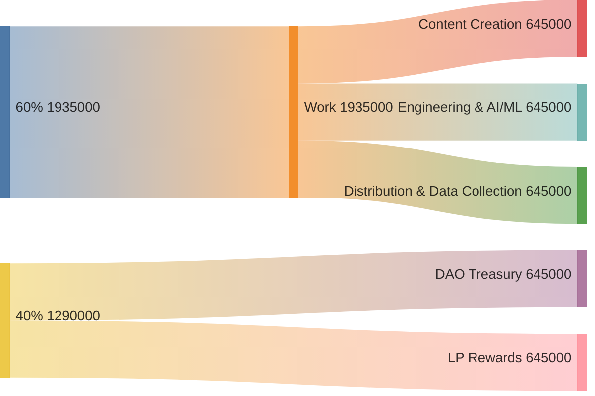

# `$ELIMU` Tokenomics 💎

```mermaid
%%{init: {"pie": {"textPosition": 0.5}, "themeVariables": {"pie1": "#d8d2e7", "pie2": "#b2a7d2", "pie3": "#c1d5b0", "pie4": "#aac1f0", "pieOuterStrokeWidth": "5px", "fontFamily": "arial"}} }%%
pie showData
    "Past open source contributors 🙌🏽": 38700000
    "Future Content Creation 🎶🎙️": 116100000
    "Future Engineering & AI/ML 👩🏽‍💻📱": 116100000
    "Future Distribution & Data Collection 🛵💨": 116100000
```

## Past Contributors

The elimu.ai software started out as an open source project in 2015. During the first six years, more than [40 people](https://github.com/elimu-ai/wiki/blob/main/CONTRIBUTING.md#elimuai---open-source-contributors-) made contributions. And 10% of the max token supply was distributed to these past contributors when the `$ELIMU` token was [announced](https://medium.com/elimu-ai/introducing-elimu-our-community-token-7767eebed862) in July 2021.

## Max Supply

The max supply of `$ELIMU` tokens is capped at 387,000,000.

## 10% Per Year

Following the token's launch in July 2021, no more than 10% of the total supply cap can be minted per year. This restriction has been coded into the token's [smart contract](https://etherscan.io/token/0xe29797910d413281d2821d5d9a989262c8121cc2#code).

For weekly updates of the token supply, see our [Dune Analytics dashboard](https://dune.com/elimu_ai/dao-token).

## Monthly Token Allocation

10% of the token supply per year equals 3,225,000 `$ELIMU` per month. And at the end of each month, 60% of the `$ELIMU` tokens are equally split between rewarding work on content creation, engineering, and distribution:

The remaining 40% are directed to liquidity provider (LP) rewards (20%) and to the DAO Treasury (20%).
