# `$ELIMU` Tokenomics 💎

## About elimu.ai

The word "elimu" is Swahili for "education." The mission of elimu.ai is to build innovative learning software that empowers out-of-school children to teach themselves basic reading📖, writing✍🏽 and math🔢. You can read more at https://github.com/elimu-ai/wiki#readme

### DAO

The product built by elimu.ai is Free and Open Source Software (FOSS). The open source project is organized as a Decentralized Autonomous Organization: **Ξlimu DAO**

The Ξlimu DAO is the financial layer surrounding the elimu.ai software product, enabling contributor coordination, contributor rewards and fundraising.

`$ELIMU` is the governance token used by the Ξlimu DAO. Contributors get rewarded with `$ELIMU` tokens, and token holders can participate in the organization's decision-making.

## Past Contributors

```mermaid
%%{init: {"pie": {"textPosition": 0.5}, "themeVariables": {"pie1": "#d8d2e7", "pie2": "#b2a7d2", "pie3": "#c1d5b0", "pie4": "#aac1f0", "pieOuterStrokeWidth": "5px", "fontFamily": "arial"}} }%%
pie showData
    "Past open-source contributors 🙌🏽": 38700000
    "Future Content Creation 🎶🎙️": 116100000
    "Future Engineering & AI/ML 👩🏽‍💻📱": 116100000
    "Future Distribution & Data Collection 🛵💨": 116100000
```

The elimu.ai software started out as an open-source project in 2015. During the first six years, more than [40 people](https://github.com/elimu-ai/wiki/blob/main/CONTRIBUTORS.md) made contributions. And 10% of the max token supply was distributed to these past contributors when the `$ELIMU` token was [announced](https://medium.com/elimu-ai/introducing-elimu-our-community-token-7767eebed862) in July 2021.

## Max Supply

The max supply of `$ELIMU` tokens is capped at 387,000,000.

## 10% per Year

Following the token's launch in July 2021, no more than 10% of the total supply cap can be minted per year. This restriction has been coded into the token's [smart contract](https://etherscan.io/token/0xe29797910d413281d2821d5d9a989262c8121cc2#code).

After the total supply cap has been reached (in July 2030 at the earliest), no more tokens can be minted by the DAO.

### Annual Growth Rate

For weekly updates of the token supply, see our [Dune Analytics dashboard](https://dune.com/elimu_ai/dao-token). Also find the most up-to-date numbers of circulating supply and total supply at https://token-api.elimu.ai.

## Monthly Token Allocation

10% of the token supply per year is 38,700,000 `$ELIMU`, which equals 3,225,000 `$ELIMU` per month. And at the end of each month, `$ELIMU` tokens are equally split between rewarding work on content creation, engineering, and distribution:

While 60% of the monthly token allocation is directed to contributor rewards, the remaining 40% is directed to the [DAO Treasury](https://app.aragon.org/dao/ethereum-mainnet/elimu.dao.eth) (20%) and to [Liquidity Provider (LP) rewards](https://rewards.elimu.ai) (20%).

### Contributor Rewards

The 1,935,000 `$ELIMU` tokens reserved for contributor rewards are distributed through the elimu.ai [Drip List 💧](https://www.drips.network/app/drip-lists/41305178594442616889778610143373288091511468151140966646158126636698), which automatically splits the tokens between `Content Creation 🎶🎙️`, `Engineering & AI/ML 👩🏽‍💻📱`, and `Distribution & Data Collection 🛵💨`.

### Token Reserve for the Future

The 645,000 `$ELIMU` tokens that are being set aside each month get added to the DAO's treasury: https://app.aragon.org/dao/ethereum-mainnet/elimu.dao.eth

DAO members can use their governance tokens to vote on how to spend from the DAO's treasury to fund future projects, as long as they align with the organization's mission—Building free open-source learning software for out-of-school children 🚀✨

### Token Liquidity

People who contribute liquidity to the token economy can deposit their liquidity pool tokens and receive rewards. The DApp for liquidity provider rewards is available at https://rewards.elimu.ai.

## DAO Governance

In order to initiate a new proposal on [Snapshot⚡](https://snapshot.box/#/s:elimu.eth), a DAO member must hold at least 387,000 `$ELIMU` tokens.

The monthly token allocations described above can be adjusted through future DAO proposals. Any holder of the `$ELIMU` token can vote on proposals, how to allocate funds donated to the DAO's treasury, for example.

The DAO can also decide to adjust the monthly liquidity provider rewards.

### DAO Roles

#### DAO Proposer 🗳️
> Holds at least 0.1% of the total supply cap: 387,000 `$ELIMU` tokens.
* Permission to publish proposals on [Snapshot⚡](https://snapshot.box/#/s:elimu.eth).

#### DAO Operator 🛞
> Holds at least 0.5% of the total supply cap: 1,935,000 `$ELIMU` tokens.
* Permission to approve/reject distributions made through the education [Sponsors 🫶🏽](https://sponsors.elimu.ai) program.
* Personalized ENS subname (`<name>.elimu.eth`) and e-mail address (`<name>@elimu.ai`).
* Permission to approve/reject Android APKs submitted at `https://<language>.elimu.ai/applications`
* Editor of educational content added at `https://<language>.elimu.ai/content`
* Permission to publish entries on the DAO's [Mirror.xyz🪞](https://mirror.xyz/elimu.eth) page.
* Permission to manage the DAO's [Drip List 💧](https://www.drips.network/app/drip-lists/41305178594442616889778610143373288091511468151140966646158126636698).
* Member of the DAO's [Safe{Wallet🔏}](https://app.safe.global/home?safe=eth:0xD452c1321E03c6e34aD8c6F60b694b1E780c4B75).

#### DAO Administrator 🔐
> Holds at least 1% of the total supply cap: 3,870,000 `$ELIMU` tokens.
* Permission to publish proposals on [Aragon🦅](https://app.aragon.org/dao/ethereum-mainnet/elimu.dao.eth).
* Permission to role management ([Guild.xyz🏰](https://guild.xyz/elimu)).
* Permission to manage the [GitHub organization](https://github.com/elimu-ai).
* Permission to manage the community chat server (Discord).
* Permission to manage the DAO's servers and domain names.

### Donated Funds

Donors have two options when making a donation to the organization: 1) via Drip List, 2) via DAO Treasury

1. If a donor chooses to use the elimu.ai [Drip List 💧](https://www.drips.network/app/drip-lists/41305178594442616889778610143373288091511468151140966646158126636698) to donate funds, there is no need to manually handle the allocation of funds because they will be split automatically.

2. On the other hand, if a donor wants the funds to be handled differently, a donation can be sent to the DAO's Treasury smart contract at `elimu.dao.eth`. And DAO members can then use their `$ELIMU` governance tokens to vote on how to allocate the donated funds.

---

  

  elimu.ai - Free open-source learning software for out-of-school children 🚀✨

  <a href="https://elimu.ai">Website 🌐</a>
  &nbsp;•&nbsp;
  <a href="https://github.com/elimu-ai/wiki#readme">Wiki 📃</a>
  &nbsp;•&nbsp;
  <a href="https://github.com/orgs/elimu-ai/projects?query=is%3Aopen">Projects 👩🏽‍💻</a>
  &nbsp;•&nbsp;
  <a href="https://github.com/elimu-ai/wiki/milestones">Milestones 🎯</a>
  &nbsp;•&nbsp;
  <a href="https://github.com/elimu-ai/wiki#open-source-community">Community 👋🏽</a>
  &nbsp;•&nbsp;
  <a href="https://www.drips.network/app/drip-lists/41305178594442616889778610143373288091511468151140966646158126636698">Support 💜</a>

